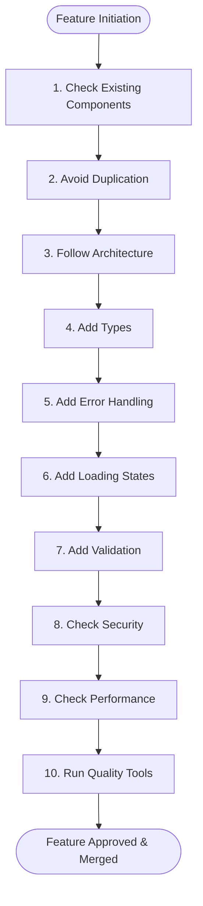

# EduHub ERP — AI & Developer Code Review Checklist (AI_CODE_REVIEW.md)

> **Permanent Review Contract & Quality Assurance Protocol**
> This document defines the permanent, mandatory code review checklist for all AI agents (Antigravity, Claude, Copilot, etc.) and software engineers contributing to the **EduHub ERP** codebase.
>
> **Every new feature, bugfix, or refactoring MUST strictly pass this 10-point checklist prior to submission or commit.**

---

## 📋 The 10-Point Pre-Feature & Review Checklist



---

### 1. 🔍 Check Existing Components

Before creating any new UI component, modal, table, or control:

- **Search the Design System First:**
  - Inspect `frontend/src/components/common/` for reusable elements.
  - Required base components:
    - Tables: `<AppTable>`
    - Buttons: `<AppButton>`
    - Modals: `<AppModal>`, `<AppConfirmModal>`
    - Dropdowns & Filters: `<AppFilterDropdown>`
    - Date Pickers: `<AppDateRangePicker>`
    - File Uploads: `<AppDropzone>`
    - Pagination: `<AppPagination>`
- **Never Re-invent Base Elements:**
  - Do not code custom table structures, modal backdrops, or styled buttons inside page views.
  - Check existing feature folders (`src/components/school/`, `src/components/students/`, `src/components/finance/`, `src/components/groups/`, `src/components/courses/`) to see if a similar domain component already exists.

---

### 2. ♻️ Avoid Duplication (Clean Codebase Hygiene)

- **DRY (Don't Repeat Yourself):**
  - Never duplicate markup, calculation logic, or API request logic across views.
  - Extract shared helper functions into `src/helper/` or `src/utils/`.
- **Zero Hardcoded Values:**
  - **API URLs:** Use centralized configuration from `@/config/api.config.js` or `process.env.VUE_APP_API_URL`.
  - **Colors:** Strictly use Tailwind design tokens (`bg-primary`, `text-emerald-600`, `border-border-subtle`). Never write inline hex colors (`#4F46E5`) or arbitrary pixel styles.
  - **Constants & Enums:** Move all business constants, payment methods, status lists, and select options into `src/constants/` (e.g. `payments.constants.js`, `education.constants.js`).
  - **Application Config:** Environment and branding strings live in `src/config/`.

---

### 3. 🏛️ Follow Architecture (Separation of Concerns)

Respect the strict architectural layering defined in `AGENTS.md` and `docs/ARCHITECTURE_RULES.md`:

```
Layer                   Location               Responsibility
------------------------------------------------------------------------------------------
Presentation (UI)   ->  src/components/        Pure presentation, props/emits, NO business logic
Page Views          ->  src/views/             Layout composition & composable binding
Reaktiv Mantiq      ->  src/composables/       Data formatting, search/filters, business workflows
Network / API       ->  src/services/          HTTP calls, payload normalization, error parsing
Global State        ->  src/store/             Pinia stores for cross-cutting application state
Domain Types        ->  src/types/             TypeScript interfaces, types, enums
```

- **Size Limits:**
  - **Component size limit:** Max **250 lines**. Split into sub-components if exceeded.
  - **Function size limit:** Max **40 lines**. Extract single-responsibility sub-functions.
- **Component Paradigm:**
  - Use Vue 3 `<script setup>`.
- **Dependency Boundaries (dependency-cruiser):**
  - `components` cannot import `pages`/`views`.
  - `services` cannot import `components` or UI elements.
  - `utils` cannot import UI components.
  - `types` cannot import executable application code.
  - `stores` cannot depend on `pages`/`views`.

---

### 4. 🏷️ Add Types (Strict TypeScript Everywhere)

- **TypeScript Strictness (`strict: true`):**
  - All domain models, DTOs, method signatures, and composable returns must be strongly typed in `src/types/`.
  - Define explicit interfaces for entities:
    - `Student`, `Course`, `Group`, `Lesson`, `Payment`, `AppNotification`, `User`, `Tenant`.
- **Zero `any` Policy:**
  - Never use `any`.
  - Use specific interfaces, generic types, unions, or `unknown` with runtime type narrowing.
- **Typecheck Verification:**
  - Must pass `npm run typecheck` (`tsc --noEmit`) with 0 errors across backend and frontend.

---

### 5. 🛡️ Add Error Handling (Graceful Degradation)

- **Centralized Error Notifications:**
  - Wrap asynchronous service calls with proper error handling.
  - Display user-friendly notification via `@/utils/toast` (`$toast.error(...)`).
- **Zero Raw Stack Traces:**
  - Never render raw backend stack traces, SQL errors, or unparsed HTTP response objects to the user.
- **Network & Fallback Handling:**
  - Handle edge cases: offline/network disconnection, 401 Unauthorized, 403 Forbidden, 404 Not Found, 422 Validation Error, and 500 Server Error.
  - Keep local component state consistent even when API requests fail.

---

### 6. ⏳ Add Loading States (Feedback & UX)

- **Visual Loading Indicators:**
  - Always provide user feedback during async operations (data fetching, form submission, deletion).
  - Use `<LoadingSpinner>` or skeleton placeholders when waiting for page data.
- **Prevent Duplicate Submissions:**
  - Disable submit/action buttons and show loading spinners while an async request is in-flight:
    ```html
    <AppButton :loading="isSubmitting" :disabled="isSubmitting" @click="handleSubmit">
      Saqlash
    </AppButton>
    ```
- **Clean Empty States:**
  - When lists or tables have 0 items, render an informative empty state instead of a blank white screen.

---

### 7. ✍️ Add Validation (Data Integrity)

- **Client-side Validation:**
  - Validate all inputs before sending network requests using centralized rules (`src/utils/validators.js` or `src/validation/`).
  - Check required fields, phone numbers (e.g. `+998...`), emails, positive numbers for amounts, and valid date ranges.
- **Server-side Alignment:**
  - Frontend validation schemas must match backend NestJS `class-validator` DTOs and Prisma schemas.
- **User Feedback:**
  - Highlight erroneous fields with red borders (`border-red-500`) and display actionable error messages below the field.

---

### 8. 🔒 Check Security (Multi-Tenancy & Sanitization)

- **Multi-Tenant Isolation:**
  - Verify that all API requests contain the required multi-tenant headers (`x-tenant-id`) managed by `@/api/client.js`.
  - Never bypass tenant filters or expose cross-organization data.
- **Authorization & RBAC:**
  - Check permissions before displaying sensitive action buttons (e.g. Delete, Refund, Export).
  - Validate user roles (`superadmin`, `admin`, `teacher`, `accountant`) using `auth.store`.
- **XSS & Injection Protection:**
  - Avoid `v-html` unless content is explicitly sanitized.
  - Never store sensitive secrets, tokens, or passwords in local repository files or frontend client code.

---

### 9. ⚡ Check Performance (Speed & Efficiency)

- **Bundle & Rendering Optimization:**
  - Use route-level code splitting (`component: () => import(...)`).
  - Use `computed` properties for derived values instead of repeated template functions.
- **Large Datasets:**
  - Always paginate lists and tables (default 10, 20, 50 items) using `<AppPagination>`.
  - Debounce real-time search inputs and filter changes (300ms–500ms delay).
- **Resource Cleanup:**
  - Clean up intervals, timeouts, websocket connections, and custom DOM listeners in `onUnmounted()`.

---

### 10. 🧪 Run Quality Tools (Automated Gate Enforcement)

Before committing or creating a pull request, run and pass all automated verification commands:

```bash
# 1. Automated code formatting and linting
npm run lint

# 2. Strict TypeScript type check (Backend + Frontend)
npm run typecheck

# 3. Architecture dependency boundary check
npm run architecture-check

# 4. Circular dependency detection
npm run dependency-check

# 5. End-to-end integration tests
npm run test:e2e

# 6. Production build verification
npm run build
```

- **Git Pre-Commit Hook:**
  - Verify that `./.husky/pre-commit` executes and passes all 4 quality stages:
    1. ESLint on staged files
    2. Prettier formatting
    3. TypeScript `tsc --noEmit` check
    4. Madge circular dependency check

---

## 🚦 Feature Sign-Off Template

When proposing or delivering a feature, provide this sign-off matrix in the pull request description or walkthrough report:

| #      | Review Step                     | Status | Evidence / Notes                                                                 |
| ------ | ------------------------------- | :----: | -------------------------------------------------------------------------------- |
| **1**  | Existing Components Checked     |   ✅   | Reused `<AppTable>`, `<AppButton>`, `<AppModal>` from `common/`                  |
| **2**  | No Duplication / Constants Used |   ✅   | Extracted constants to `src/constants/`                                          |
| **3**  | Architecture Followed           |   ✅   | Component < 250 lines, API in `services/`, logic in `composables/`               |
| **4**  | Types Added                     |   ✅   | Strict TypeScript interface added to `src/types/`                                |
| **5**  | Error Handling Added            |   ✅   | Handled try/catch, toast alerts via `$toast`                                     |
| **6**  | Loading States Added            |   ✅   | Spinner and disabled submit buttons during request                               |
| **7**  | Validation Added                |   ✅   | Validated inputs with `validators.js`                                            |
| **8**  | Security Checked                |   ✅   | Tenant header enforced, RBAC checked, no `v-html`                                |
| **9**  | Performance Checked             |   ✅   | Debounced search, paginated list, unmounted cleanup                              |
| **10** | Quality Tools Run               |   ✅   | `lint`, `typecheck`, `architecture-check`, `dependency-check`, `test:e2e` passed |

> **Non-negotiable rule:** If any item in this checklist is marked ❌, the feature cannot be merged into production.
