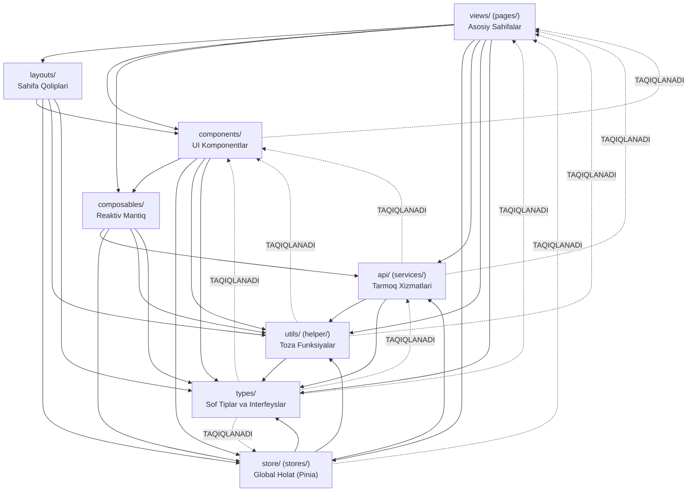

# EduHub ERP — Arxitektura Qoidalari va Qatlamlararo Bog'liqliklar Standarti (ARCHITECTURE_RULES.md)

> **Hujjat maqsadi:** EduHub ERP tizimida qatlamlararo toza arxitekturani (Clean / Layered Architecture) saqlash, bir tomonlama bog'liqlik (Unidirectional Dependency) tamoyiliga qat'iy rioya qilish hamda `dependency-cruiser` orqali arxitektura buzilishlarining oldini olish.

---

## 🏛️ 1. Arxitektura Qatlamlari va Kataloglar Tuzilmasi

EduHub ERP frontend tizimi quyidagi 8 ta asosiy mantiqiy qatlamdan iborat:

```
src/
 ├── components/     # Qayta ishlatiluvchi UI vidjetlar, form elementlari, jadvallar
 ├── views/ (pages/) # Router orqali ochiluvchi asosiy biznes sahifalar (Views / Pages)
 ├── layouts/        # Sahifa qoliplari (DefaultLayout, AuthLayout, DashboardLayout)
 ├── composables/    # Reaktiv biznes mantiq, filtrlash, saralash va holatlar
 ├── api/ (services/)# Backend REST API bilan aloqa qiluvchi tarmoq xizmatlari
 ├── store/ (stores/)# Pinia orqali boshqariluvchi global ilova holati (Auth, Tenant)
 ├── types/          # Domen modellari, interfeyslar va sof TypeScript tiplari
 └── utils/ (helper/)# Toza yordamchi funksiyalar (formatlash, sana, xavfsiz JSON)
```

---

## 📊 2. Qatlamlararo Ruxsat Etilgan Yo'nalishlar (Dependency Graph)

Qatlamlararo bog'liqlik har doim **yuqoridan pastga (Top-Down)** qarab yo'nalishi shart:



---

## 🚦 3. 5 ta Qat'iy Arxitektura Qoidasi (5 Core Rules)

Ushbu qoidalar `frontend/dependency-cruiser.js` faylida dasturlangan bo'lib, har qanday buzilish build jarayonini to'xtatadi (`Exit code 1`).

---

### 1-Qoida: Komponentlar Sahifalarni Import Qila Olmaydi (`components-cannot-import-pages`)

- **Manba (From):** `src/components/**`
- **Nishon (To):** `src/views/**` yoki `src/pages/**`
- **Nega taqiqlanadi?** Komponentlar (`AppTable`, `AppModal`, `StudentCard`) universal va ko'p marta ishlatiluvchi bo'lishi kerak. Agar komponent muayyan bir sahifaga (`Dashboard.vue`, `SchoolStudentsView.vue`) to'g'ridan-to'g'ri bog'lansa, u mustaqilligini yo'qotadi, aylanma bog'liqlik keltirib chiqaradi va qayta ishlatib bo'lmaydi.
- ❌ **Noto'g'ri:**
  ```typescript
  // src/components/school/StudentCard.vue
  import SchoolStudentsView from "@/views/school/SchoolStudentsView.vue"; // ❌ TAQIQLANGAN
  ```
- ✅ **To'g'ri:**
  ```typescript
  // src/components/school/StudentCard.vue
  // Ma'lumotlarni props orqali qabul qiling va eventlarni emit orqali yuqoriga uzating
  defineProps<{ student: Student }>();
  defineEmits<{ (e: "select", id: string): void }>();
  ```

---

### 2-Qoida: Servislar Komponentlarni Import Qila Olmaydi (`services-cannot-import-components`)

- **Manba (From):** `src/api/**` yoki `src/services/**`
- **Nishon (To):** `src/components/**` (hamda umumiy UI)
- **Nega taqiqlanadi?** Servislar faqat HTTP/REST so'rovlari va ma'lumotlar bilan ishlashga javobgardir (Separation of Concerns). Tarmoq qatlamiga Vue komponentlarini, UI tugmalarini yoki modal darchalarni olib kirish tizim portativligini butunlay buzadi.
- ❌ **Noto'g'ri:**
  ```typescript
  // src/api/services.js
  import AppModal from "@/components/common/AppModal.vue"; // ❌ TAQIQLANGAN
  ```
- ✅ **To'g'ri:**
  ```typescript
  // src/api/services.js
  import api from "@/api/client";
  import type { ApiResponse, Student } from "@/types";

  export const studentsApi = {
    getAll: () => api.get<ApiResponse<Student[]>>("/students"),
  };
  ```

---

### 3-Qoida: Utils Qatlami UI Elementlarini Import Qila Olmaydi (`utils-cannot-import-ui`)

- **Manba (From):** `src/utils/**` yoki `src/helper/**`
- **Nishon (To):** `src/components/**`, `src/views/**`, `src/layouts/**`
- **Nega taqiqlanadi?** Util funksiyalar (valyuta formatlash, telefon raqamni tozalash, xavfsiz JSON parse) "Pure Function" (sof funksiya) bo'lishi lozim. Ular brauzer DOM'i yoki Vue komponentlariga bog'liq bo'lmasligi, har qanday kontekstda (hatto NodeJS/WebWorker ichida ham) ishlay olishi shart.
- ❌ **Noto'g'ri:**
  ```typescript
  // src/utils/formatters.js
  import AppStatusBadge from "@/components/common/AppStatusBadge.vue"; // ❌ TAQIQLANGAN
  ```
- ✅ **To'g'ri:**
  ```typescript
  // src/utils/formatters.js
  // Faqat sof ma'lumot qaytaradi:
  export function formatMoney(amount: number): string {
    return new Intl.NumberFormat("uz-UZ").format(amount) + " so'm";
  }
  ```

---

### 4-Qoida: Types Qatlami Ilova Kodini Import Qila Olmaydi (`types-cannot-import-application-code`)

- **Manba (From):** `src/types/**`
- **Nishon (To):** `src/components/**`, `src/views/**`, `src/api/**`, `src/store/**`, `src/utils/**`
- **Nega taqiqlanadi?** Turlar faqat kontrakt va interfeyslarni ifodalaydi. `types/` ichida runtime mantiq, funksiyalar yoki ilova kodining import qilinishi JavaScript kompilyatsiya bundle hajmiga keraksiz ta'sir ko'rsatadi va aylanma sikllar keltirib chiqaradi.
- ❌ **Noto'g'ri:**
  ```typescript
  // src/types/student.ts
  import { authApi } from "@/api/services"; // ❌ TAQIQLANGAN
  import useAuthStore from "@/store/auth"; // ❌ TAQIQLANGAN
  ```
- ✅ **To'g'ri:**
  ```typescript
  // src/types/student.ts
  export interface Student {
    id: string;
    fullName: string;
    phone: string;
    status: "ACTIVE" | "INACTIVE";
  }
  ```

---

### 5-Qoida: Store'lar Sahifalarga Bog'liq Bo'la Olmaydi (`stores-cannot-depend-on-pages`)

- **Manba (From):** `src/store/**` yoki `src/stores/**`
- **Nishon (To):** `src/views/**` yoki `src/pages/**`
- **Nega taqiqlanadi?** Pinia store'lar butun ilova bo'ylab foydalaniladigan global holat (masalan, token, faol tashkilot, autentifikatsiyadan o'tgan foydalanuvchi) uchun javobgar. Ular alohida sahifaga (`Dashboard`, `LeadsKanban`, `FinanceView`) bog'lanmasligi kerak; aksincha, sahifalar store'dan ma'lumot oladi.
- ❌ **Noto'g'ri:**
  ```typescript
  // src/store/auth.js
  import LoginView from "@/views/layouts/auth/Login.vue"; // ❌ TAQIQLANGAN
  ```
- ✅ **To'g'ri:**
  ```typescript
  // src/store/auth.js
  import { defineStore } from "pinia";
  import { authApi } from "@/api/services";

  export const useAuthStore = defineStore("auth", {
    state: () => ({ token: null, user: null }),
    // ...
  });
  ```

---

### Qo'shimcha Qoida: Aylanma Bog'liqliklar Taqiqi (`no-circular`)

- **Izoh:** Hech bir modul o'zaro bir-birini aylanma import qilolmaydi (A -> B -> A). Bu runtime'da `undefined` qiymatlar va xotira oqishini (memory leak) oldini oladi.

---

## 📋 4. Qatlamlararo Bog'liqlik Matritsasi (Dependency Matrix)

| Qayerdan (From) \ Qayerga (To) | `types` |      `utils`       |  `api` (services)  |      `store`       |   `composables`    |    `components`    |     `layouts`      |  `views` (pages)   |
| :----------------------------- | :-----: | :----------------: | :----------------: | :----------------: | :----------------: | :----------------: | :----------------: | :----------------: |
| **`views` (pages)**            |   ✅    |         ✅         |         ✅         |         ✅         |         ✅         |         ✅         |         ✅         |   ⚠️ (subviews)    |
| **`layouts`**                  |   ✅    |         ✅         |         ❌         |         ✅         |         ❌         |         ✅         |         ❌         |         ❌         |
| **`components`**               |   ✅    |         ✅         |         ❌         |         ✅         |         ✅         |         ✅         |         ❌         | 🚫 **TAQIQLANGAN** |
| **`composables`**              |   ✅    |         ✅         |         ✅         |         ✅         |         ⚠️         |         ❌         |         ❌         |         ❌         |
| **`store`**                    |   ✅    |         ✅         |         ✅         |         ⚠️         |         ❌         |         ❌         |         ❌         | 🚫 **TAQIQLANGAN** |
| **`api` (services)**           |   ✅    |         ✅         |         ⚠️         |         ❌         |         ❌         | 🚫 **TAQIQLANGAN** |         ❌         | 🚫 **TAQIQLANGAN** |
| **`utils` (helper)**           |   ✅    |         ⚠️         |         ❌         |         ❌         |         ❌         | 🚫 **TAQIQLANGAN** |         ❌         | 🚫 **TAQIQLANGAN** |
| **`types`**                    |   ⚠️    | 🚫 **TAQIQLANGAN** | 🚫 **TAQIQLANGAN** | 🚫 **TAQIQLANGAN** | 🚫 **TAQIQLANGAN** | 🚫 **TAQIQLANGAN** | 🚫 **TAQIQLANGAN** | 🚫 **TAQIQLANGAN** |

_Belgilar:_

- ✅ **Ruxsat berilgan:** Standart arxitektura oqimi.
- 🚫 **Qat'iy taqiqlangan:** `dependency-cruiser` orqali bloklanadi (Exit code 1).
- ❌ **Tavsiya etilmaydi:** Yaxshi amaliyotlarga ko'ra cheklanadi.
- ⚠️ **Ehtiyotkorlik bilan:** Faqat o'sha qatlam ichidagi yordamchi fayllar bilan.

---

## 💻 5. Buyruqlar va Sinovdan O'tkazish

### 1. Arxitektura Sifatini Tekshirish

Loyihaning ildiz papkasida yoki frontend qismida buyruqni bering:

```bash
# Loyiha ildizida:
npm run architecture-check

# Yoki frontend ichida:
npm --prefix frontend run architecture-check
```

### 2. Kutilayotgan Konsol Natijasi

```bash
✔ no dependency violations found (193 modules, 532 dependencies cruised)
```

### 3. Umumiy Sifat Nazoratiga Qo'shilishi

Ushbu tekshiruv `npm run quality-check` (Pre-Merge Quality Gate) tarkibiga to'liq integratsiya qilingan:

```bash
npm run quality-check
```

Pipeline ketma-ketligi:

1. Backend Typecheck (`tsc --noEmit`)
2. Frontend ESLint (`eslint src`)
3. **Frontend Architecture Check (`depcruise src --config dependency-cruiser.js`)**
4. Backend Test Coverage (`jest --coverage`)
5. Frontend E2E Tests (`playwright test`)
6. Dead Code Audit (`knip`)

---

## 🏆 6. Xulosa

`dependency-cruiser` orqali o'rnatilgan arxitektura qoidalari EduHub ERP loyihasining kelgusi kengayishida texnik qarz to'planishining, tartibsiz `import`larning va qatlamlararo chalkashliklarning oldini oladi. Har bir yangi xususiyat va refaktoring ushbu qoidalar doirasida amalga oshirilishi shart.
