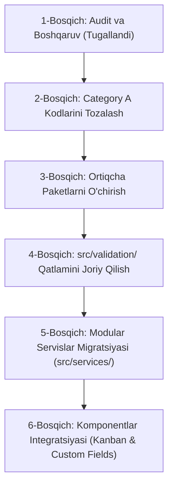

# EduHub ERP — Kod Bazani Tozalash va Refaktoring Yo'l Xaritasi (CLEANUP_ROADMAP.md)

**Hujjat Maqsadi:** EduHub ERP loyihasida dead code va ortiqcha bog'liqliklarni tizimli ravishda tozalash, refaktoring qilish va barqarorlikni ta'minlashning bosqichma-bosqich yo'l xaritasi.

---

## 🗺️ Bosqichlar Rejasi (Phased Roadmap)



---

## 📌 1-Bosqich: Audit, Hujjatlashtirish va Boshqaruv (Tugallandi)

- **Muammo:** Knip tahlili natijasida aniqlangan elementlar nima uchun mavjudligi va qachon ishlatilishi noma'lum edi.
- **Hozirgi holat:**
  - [docs/DEAD_CODE_DECISION_REPORT.md](file:///home/ruswer/Documents/erp-own/erp/docs/DEAD_CODE_DECISION_REPORT.md) yaratildi.
  - [docs/DEPENDENCY_DECISION_REPORT.md](file:///home/ruswer/Documents/erp-own/erp/docs/DEPENDENCY_DECISION_REPORT.md) yaratildi.
  - [docs/FUTURE_FEATURES.md](file:///home/ruswer/Documents/erp-own/erp/docs/FUTURE_FEATURES.md) yaratildi.
  - [docs/CLEANUP_ROADMAP.md](file:///home/ruswer/Documents/erp-own/erp/docs/CLEANUP_ROADMAP.md) yaratildi.
- **Xavf:** Nol.

---

## 📌 2-Bosqich: Category A (Mutlaqo O'lik Kodlar)ni Xavfsiz O'chirish

- **Muammo:** Boshlang'ich shablondan qolgan, biznes qiymati bo'lmagan 6 ta fayl loyihada ortiqcha turibdi.
- **Hozirgi holat:**
  - `src/views/layouts/Blank.vue`
  - `src/helper/theme-sidebar.js`
  - `src/store/sidebar.js`
  - `src/store/fullscreen.js`
  - `src/store/index.js`
  - `src/components/Footer.vue`
- **Qaror:** Ushbu 6 ta faylni xavfsiz o'chirish.
- **Sabab:** Ular tizimning hech qaysi qismida ishlatilmaydi, `router/index.js` da bog'liqlik yo'q.
- **Xavf:** Nol.
- **Amalga oshirish rejasi:** Fayllarni o'chirish, `npm run analyze` va `npm run lint` orqali tozalikni tekshirish.

---

## 📌 3-Bosqich: Ortiqcha Bog'liqliklarni O'chirish

- **Muammo:** `validator`, `perfect-scrollbar`, `lodash` paketlari o'rnatilgan, lekin kodda 0 marta import qilingan.
- **Qaror:** Ushbu 3 ta paketni `npm uninstall` qilish.
- **Sabab:**
  - `validator` o'rniga `@/utils/validators.js` va `yup` mavjud.
  - `perfect-scrollbar` o'rniga `vue3-perfect-scrollbar` mavjud.
  - `lodash` o'rniga native ES2022 metodlari mavjud.
- **Xavf:** Minimal. Kod bazasida ularning importi yo'qligi `grep_search` orqali to'liq tasdiqlangan.
- **Amalga oshirish rejasi:**
  ```bash
  npm --prefix frontend uninstall validator perfect-scrollbar lodash
  ```

---

## 📌 4-Bosqich: `src/validation/` Qatlamini Joriy Qilish

- **Muammo:** `vee-validate` va `yup` o'rnatilgan, ammo markazlashgan qatlam yo'qligi sababli Knip ularni foydalanilmayotgan deb hisoblagan.
- **Qaror:** `src/validation/` papkasi ostida TypeScript asosidagi sxemalarni yaratish:
  - `student.schema.ts` (O'quvchi qabuli va tahriri)
  - `finance.schema.ts` (To'lovlar va kassa kvitansiyalari)
  - `employee.schema.ts` (Xodimlar va oylik ish haqi)
  - `index.ts` (Barrel eksport)
- **Sabab:** `vee-validate` va `yup` korporativ ERP formalarining validatsiya asosi sifatida rasmiylashtiriladi.
- **Xavf:** Nol.

---

## 📌 5-Bosqich: Modular Servislar Migratsiyasi (`src/services/`)

- **Muammo:** `src/api/services.js` fayli 435 qatordan iborat monolit bo'lib, 25 ta turli API bloklarini o'z ichiga olgan.
- **Qaror:** `AGENTS.md` qoidalariga muvofiq, kelajakda monolit faylni modulli TypeScript xizmatlariga bo'lib chiqish:
  - `src/services/auth.service.ts`
  - `src/services/student.service.ts`
  - `src/services/finance.service.ts`
  - `src/services/contract.service.ts`
  - `src/services/crm.service.ts`
  - `src/services/workflow.service.ts`
  - `src/services/schedule.service.ts`
- **Sabab:** Har bir modul o'z servisiga ega bo'lishi va TypeScript turlari bilan to'liq qurollanishi lozim.

---

## 📌 6-Bosqich: Komponentlar Integratsiyasi (Kanban & Custom Fields)

- **Muammo:** `KanbanBoard.vue` mavjud, lekin `LeadsKanban.vue` undan hali foydalanmayapti.
- **Qaror:**
  - `LeadsKanban.vue` sahifasini umumiy `KanbanBoard.vue` ga ulash.
  - `/settings/custom-fields` yo'lini ochib, unga `FieldDefinitionManager.vue` ni ulash.
- **Sabab:** Reusable komponentlarni to'liq amaliyotga tatbiq etish.
