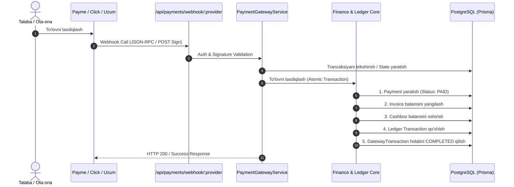

# 💳 EduHub: To'lov Shlyuzlari Integratsiyasi Texnik Spetsifikatsiyasi
**Hujjat turi:** Texnik Arxitektura va Spetsifikatsiya (Design Document)  
**Holati:** Ko'rib chiqish uchun tayyor (Review Ready)  
**Qamrovi:** Payme (Merchant API), Click (Merchant API), Uzum Pay / Bank  
**Maqsad:** EduHub SaaS platformasida talabalar/ota-onalardan o'qish to'lovlarini avtomatlashtirilgan holda qabul qilish va Finance Core tizimiga bog'lash.

---

## 1. Kirish va Maqsad

Ushbu spetsifikatsiya EduHub ta'lim platformasida O'zbekistonning yetakchi to'lov provayderlari (**Payme**, **Click**, **Uzum Pay**) orqali to'lovlarni qabul qilish, hisob-fakturalarni (Invoice) avtomatik yopish va moliyaviy hisob-kitoblarni (Finance Ledger) to'liq avtomatlashtirishning arxitekturasini belgilaydi.

### Asosiy biznes maqsadlari:
1. Talaba/Ota-ona shaxsiy kabinet yoki mobil ilovadan turib to'g'ridan-to'g'ri to'lov qila olishi.
2. QR-kod yoki to'lov havolasi (Payment Link) orqali to'lovlarni amalga oshirish.
3. To'lov amalga oshishi bilanoq tizimda qarz avtomatik yopilishi, kassa balansi oshishi va SMS/Telegram xabarnoma yuborilishi.
4. Har bir tashkilot (Tenant) o'zining mustaqil to'lov shlyuzlari hisob raqamiga (Merchant ID / Secret Key) ega bo'lishi (Multi-tenant SaaS modeli).

---

## 2. Mavjud Data Modellar Tahlili va Moslashuvchanlik

Hozirgi `backend/prisma/schema.prisma` dagi modellar mavjud bo'lib, ular quyidagicha ishlaydi:

| Model | Mavjud vazifasi | Webhook oqimidagi roli |
| :--- | :--- | :--- |
| `Payment` | Yakuniy to'lov hujjati (`amount`, `method`, `status`, `receiptNumber`). `PaymentMethod` da `PAYME`, `CLICK`, `UZUM` mavjud. | To'lov muvaffaqiyatli yakunlanganda (`PAID`) yagona to'lov yozuvi sifatida saqlanadi. |
| `Invoice` | Talaba/Mijoz hisob-fakturasi (`totalAmount`, `paidAmount`, `status`). | Agar to'lov aniq bir hisob-faktura uchun qilingan bo'lsa, `paidAmount` oshiriladi va statusi `PAID`/`PARTIALLY_PAID` ga o'zgartiriladi. |
| `PaymentAllocation` | To'lovni hisob-fakturaga taqsimlash. | `Payment` va `Invoice` o'rtasidagi summani bog'laydi. |
| `Cashbox` | Filial kassasi/hisob raqami (`balance`). | Har bir to'lov shlyuzi uchun maxsus elektron kassa (masalan, "Payme Kassasi", "Click Kassasi") ochiladi va balans oshiriladi. |
| `Transaction` | Buxgalteriya ledgeri (kirim/chiqim jurnali). | Kassa balansi o'zgarganda audit va hisobot uchun avtomatik `INCOME` tranzaksiyasi yaratiladi. |

### Webhook kelganda ma'lumotlar oqimi:


---

## 3. Shlyuzlar Bo'yicha Spetsifikatsiya

### 3.1. Payme (Merchant API — JSON-RPC 2.0)
- **Protokol:** HTTP POST / JSON-RPC 2.0
- **Autentifikatsiya:** HTTP Basic Auth (`Authorization: Basic base64(Paycom:SECRET_KEY)`)
- **Summa formati:** Tiyin (1 UZS = 100 tiyin. Masalan: 500 000 so'm = `50000000`)
- **Talab qilinadigan metodlar:**
  1. `CheckPerformTransaction`: Talaba ID yoki Invoice ID mavjudligi va to'lov summasini tekshirish.
  2. `CreateTransaction`: To'lov holatini `STATE_CREATED` (1) qilib ochish va vaqtinchalik muzlatish (timeout: 12 soat).
  3. `PerformTransaction`: To'lovni yakunlash (`STATE_COMPLETED` = 2), `Payment` va `Transaction` yozish.
  4. `CancelTransaction`: To'lovni bekor qilish yoki qaytarish (`STATE_CANCELLED` = -1 yoki -2), `RefundRecord` yozish.
  5. `CheckTransaction`: Tranzaksiya holatini tekshirish.
  6. `GetStatement`: Belgilangan vaqt oralig'idagi barcha tranzaksiyalar reestrini qaytarish.

### 3.2. Click (Merchant API — Form/JSON Callback)
- **Protokol:** HTTP POST (application/x-www-form-urlencoded yoki application/json)
- **Autentifikatsiya:** MD5 Hash Signature tekshiruvi:
  `MD5(click_trans_id + service_id + SECRET_KEY + merchant_trans_id + amount + action + sign_time)`
- **Summa formati:** So'm (UZS, float/decimal)
- **Talab qilinadigan Action'lar:**
  1. `action=0` (Prepare): Mijoz, Invoice va summa to'g'riligini tasdiqlash.
  2. `action=1` (Complete): To'lovni qabul qilish, moliyaviy operatsiyalarni yakunlash.
- **Qaytariladigan javob:** `{ error: 0, error_note: "Success", click_trans_id, merchant_trans_id, merchant_prepare_id }`

### 3.3. Uzum Pay / Bank (Merchant Checkout API)
- **Protokol:** RESTful Webhooks (JSON payload)
- **Autentifikatsiya:** Bearer Token yoki HMAC-SHA256 Header Signature (`X-Signature: hex(HMAC_SHA256(body, SECRET_KEY))`)
- **Summa formati:** Tiyin (1 UZS = 100 tiyin)
- **Talab qilinadigan Webhook Eventlari:**
  1. `payment.check`: To'lov oldi tekshiruvi.
  2. `payment.created`: Tranzaksiya boshlangani haqida xabar.
  3. `payment.confirmed`: To'lov muvaffaqiyatli o'tgani — to'lovni tasdiqlash va kvitansiya generatsiya qilish.
  4. `payment.failed` / `payment.cancelled`: Bekor bo'lgan to'lovlar.

---

## 4. Taklif Etilayotgan Yangi Modellar (Prisma Schema Proposal)

Quyidagi modellar kelgusi implementatsiya bosqichida `schema.prisma` ga qo'shish uchun tavsiya etiladi (hozircha kodga tegilmaydi):

```prisma
// Shlyuz tranzaksiyalari holati
enum GatewayTransactionStatus {
  INITIALIZED
  PENDING
  COMPLETED
  CANCELLED
  FAILED
}

// Tashkilotning shlyuz konfiguratsiyasi (Multi-tenant)
model PaymentGatewayConfig {
  id             String          @id @default(uuid())
  organizationId String
  organization   Organization    @relation(fields: [organizationId], references: [id], onDelete: Cascade)
  branchId       String?
  branch         Branch?         @relation(fields: [branchId], references: [id], onDelete: SetNull)
  provider       PaymentMethod   // PAYME, CLICK, UZUM
  merchantId     String          // Shlyuzdagi Merchant ID / Service ID
  secretKey      String          // Shifrlangan holda saqlanuvchi Secret Key
  cashboxId      String?         // Ushbu shlyuzga bog'langan maxsus kassa
  cashbox        Cashbox?        @relation(fields: [cashboxId], references: [id], onDelete: SetNull)
  isActive       Boolean         @default(true)
  createdAt      DateTime        @default(now())
  updatedAt      DateTime        @updatedAt

  @@unique([organizationId, provider, branchId])
  @@index([organizationId, provider])
}

// Shlyuz tranzaksiyalari jurnali
model PaymentGatewayTransaction {
  id                    String                   @id @default(uuid())
  organizationId        String
  organization          Organization             @relation(fields: [organizationId], references: [id], onDelete: Cascade)
  provider              PaymentMethod            // PAYME, CLICK, UZUM
  providerTransactionId String                   // Paycom tranzaksiya ID, Click trans_id yoki Uzum payment_id
  internalPaymentId     String?                  @unique
  payment               Payment?                 @relation(fields: [internalPaymentId], references: [id], onDelete: SetNull)
  studentId             String?
  student               Student?                 @relation(fields: [studentId], references: [id], onDelete: SetNull)
  invoiceId             String?
  invoice               Invoice?                 @relation(fields: [invoiceId], references: [id], onDelete: SetNull)
  amount                Decimal                  @db.Decimal(12, 2)
  status                GatewayTransactionStatus @default(PENDING)
  providerState         Int?                     // Payme: 1 (created), 2 (performed), -1/-2 (cancelled)
  cancelReason          Int?                     // Payme cancel reason kodi
  requestPayload        Json?                    // Webhook dastlabki so'rovi
  responsePayload       Json?                    // Webhookka qaytarilgan javob
  createdAt             DateTime                 @default(now())
  performedAt           DateTime?
  cancelledAt           DateTime?

  @@unique([provider, providerTransactionId])
  @@index([organizationId, provider])
  @@index([status])
}
```

---

## 5. Xavfsizlik va Ishonchlilik Talablari

### 5.1. Autentifikatsiya va Imzo Tekshiruvi (Signature Verification)
- Har bir webhook kontrolleriga kelgan so'rov eng birinchi navbatda `GatewayAuthGuard` orqali tekshirilishi shart.
- Noto'g'ri kalit yoki mos kelmagan imzo (MD5 / HMAC / Basic Auth) kelganda so'rov darhol standart xatolik kodi (Payme: `-32504`, Click: `error: -1`, Uzum: `401 Unauthorized`) bilan to'xtatiladi.

### 5.2. Idempotency (Bir xil to'lovni takror qayta ishlamaslik)
- To'lov provayderlari tarmoq kechikishlari tufayli bir xil webhookni 2-3 marta qayta yuborishi mumkin (retry policy).
- Har bir `providerTransactionId` bo'yicha bazada qat'iy `unique` cheklovi bo'ladi.
- To'lov tasdiqlash jarayoni PostgreSQL darajasida **Prisma Interactive Transaction** (`prisma.$transaction`) ichida bajarilib, parallel kelgan so'rovlar bloklanadi (Double-spending protection).

### 5.3. Summa va Tiyin Konvertatsiyasi
- Payme va Uzum so'rovlarni **tiyinda** (integer) yuboradi. Baza va hisob-kitoblar esa **so'mda** (`Decimal(12,2)`).
- Konvertatsiya qat'iy standart asosida markazlashgan utilit orqali amalga oshiriladi:
  - `toSum(tiyin: number): Decimal => new Decimal(tiyin).dividedBy(100)`
  - `toTiyin(sum: Decimal): number => sum.times(100).toNumber()`

### 5.4. IP Whitelisting (Tarmoq xavfsizligi)
- Faqatgina rasmiy Payme, Click va Uzum serverlari IP diapazonlaridan kelgan so'rovlarga ruxsat beriladi (NestJS Middleware yoki Nginx darajasida).

---

## 6. Keyingi Bosqich: Implementatsiya Rejasi (Action Plan)

Ushbu spetsifikatsiya tasdiqlangandan so'ng quyidagi tartibda implementatsiya qilinadi:

1. **Prisma Migratsiyasi**: `PaymentGatewayConfig` va `PaymentGatewayTransaction` modellarini qo'shish.
2. **Gateway Moduli**: `src/gateways/` (har bir provayder uchun strategiyalar: `payme.service.ts`, `click.service.ts`, `uzum.service.ts`).
3. **Webhook Kontrollerlari**: `src/gateways/controllers/` (ochiq, lekin guard bilan himoyalangan umumiy webhook marshrutlari).
4. **Finance Core Bog'lanishi**: To'lov o'tganda `FinanceService` dagi mavjud `createPayment`, `allocatePayment` funksiyalarini tranzaksion chaqirish.
5. **Frontend Sozlamalari**: Har bir markaz o'zining Payme/Click kalitlarini kiritishi uchun Sozlamalar (Settings -> Integrations) sahifasini tayyorlash.